метрики до запуска скрипта из 2 задания

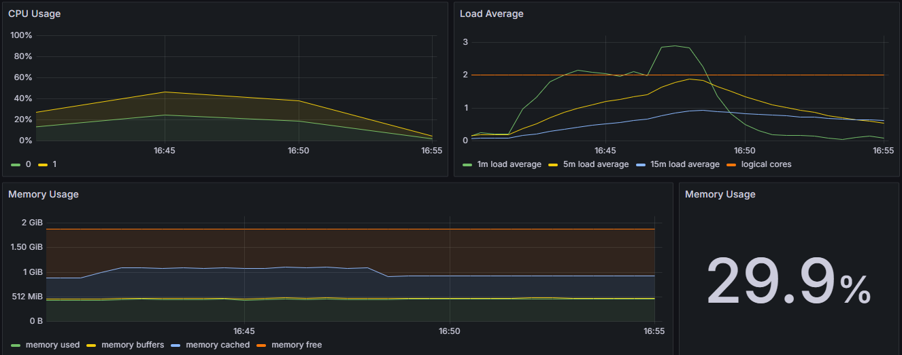

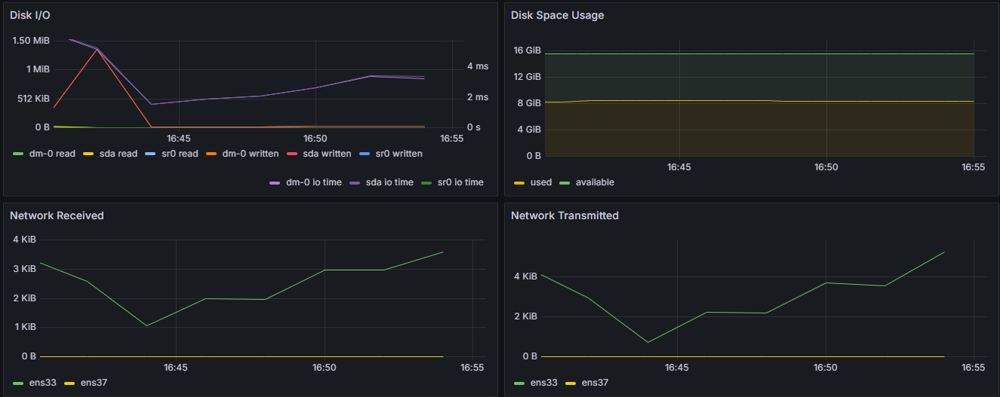

запуск скрипта

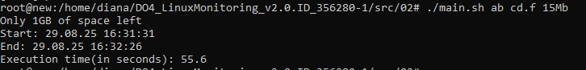

метрики после скрипта

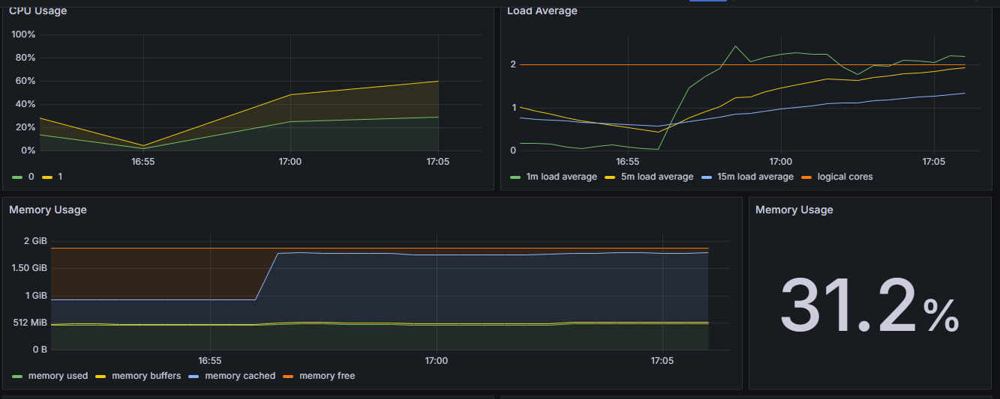

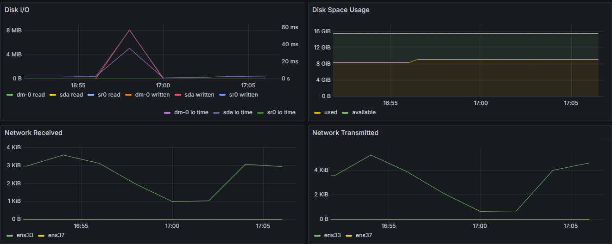

до команды stress -c 2 -i 1 -m 1 --vm-bytes 32M -t 10s

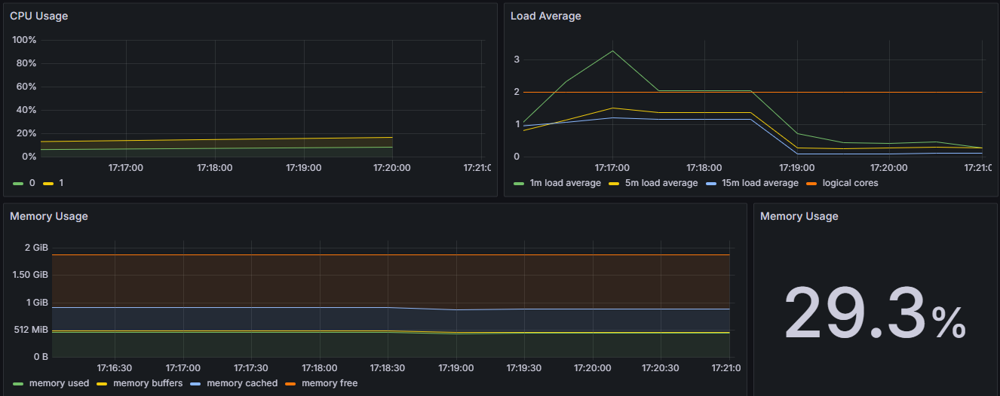

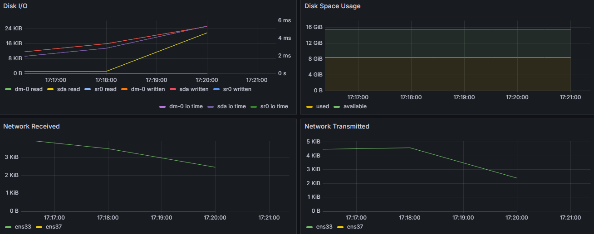

ввод команды

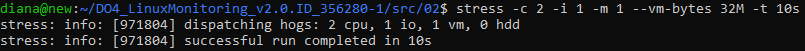

метрики после

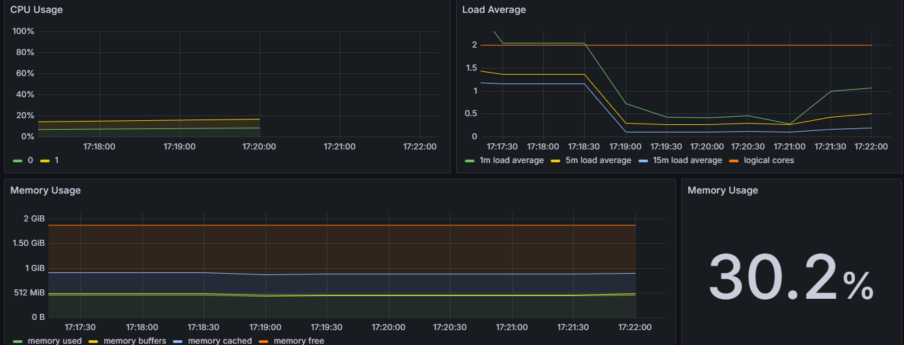

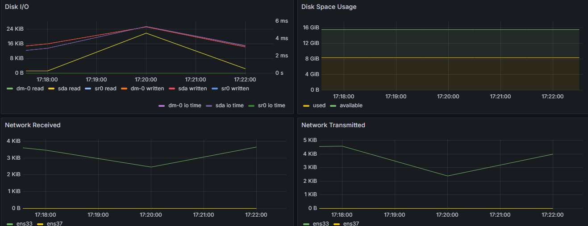

метрики до измерения сети с iperf3

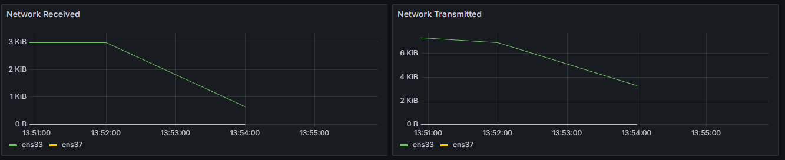

ввод команды на второй машине, которая будет играть роль принимающего сервера

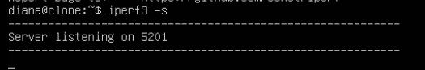

ввод команды на основной машине

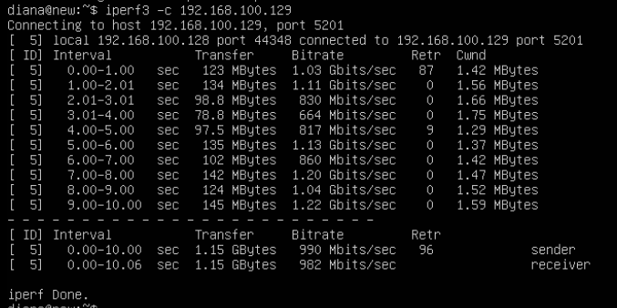

метрики после этого

